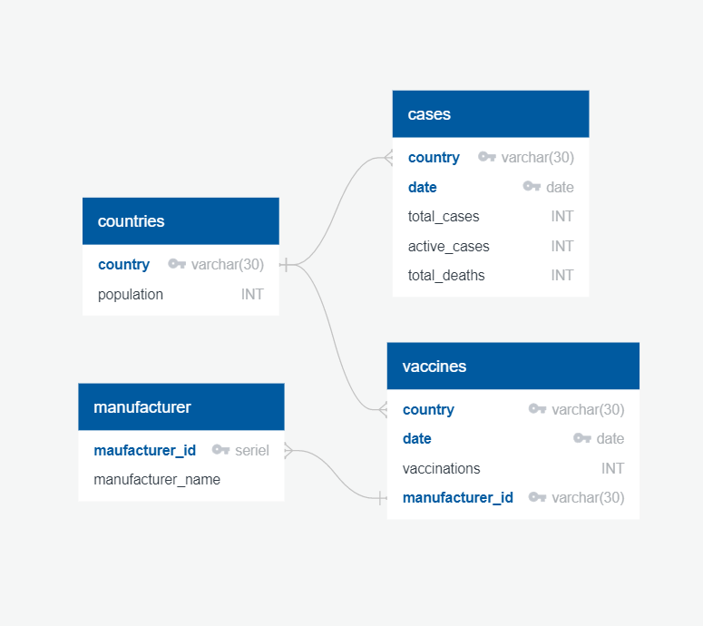

# ETL-Project

Given the current pandemic, we decided to base our ETL project on the amount of global Covid-19 cases since January of 2020 to present day and the distribution of the Covid-19 vaccines from December of 2020. 
## Extraction
- We pulled our Covid-19 cases data from the dataset repository site, [Kaggle](https://www.kaggle.com/josephassaker/covid19-global-dataset).  We also used [Kaggle](https://www.kaggle.com/gpreda/covid-world-vaccination-progress) to pull Vaccine distribution data. 
     - The preview functionality of this data helped us in determining to use it since it allowed us to view and edit the columns to ensure that it contained the information that we wanted. 
    - The data pulled was formatted as a CSV file. 
- The last source of data extraction was using the 'List of countries and dependencies by population' [Wikipedia](https://en.wikipedia.org/wiki/List_of_countries_and_dependencies_by_population) page to pull population data.
    
   

## Transformation
- ### Poplulation Data
    - Pandas was used to read the html and store the Population by Countries table in a Pandas data-frame. 
    - The Population table was formatted to drop unnecessary columns and the column names were changed to make the transformation section easier. 
    - Used string manipulation to make the formatting of the country values uniform with the formatting of values in the csv files pulled from Kaggle.
        - This was done to effectively use the country name as a primary key and allow for merging when necessary.

- ### Entity Relationship Diagram (ERD)
    - [Quick Database Diagrams](https://www.quickdatabasediagrams.com/) was used to create a visualization roadmap of how we would organize our data.
        - The ERD was put together to show the tables that make up the database along with the corresponding primary keys.

- ### Covid Cases
    - Performed an inner-merge between the pop table and the cases table on the "Country" field.  This was done to bring in the population size of all countries listed on the cases dataset.  
    - The next step was to rename all of the column headers.
    - A new Population table was stored as a data-frame by removing duplicate entries for Population and Country from the Cases table above. 

- ### Vaccine Distributions
    - Downloaded the following dataset from Kaggle -> country_vaccinations_by_manufacturer.csv.
    - The vaccine dataset was stored as a dataframe (vax_man_df) to be able to read it in Pandas. 
    - Vaccine manufacturer names were standardized into 4-character IDs as follows:
        - 'Pfizer/BioNTech' : ['PFZR'],
        - 'Sinovac' : ['SNVC'],
        - 'Moderna' : ['MDRN'],
        - 'Oxford/AstraZeneca' : ['OXFD'],
        - 'Johnson&Johnson' : ['JSJS']
    - Vaccine dataset column headers were updated as follows:
        - 'vaccine' : 'manufacturer_id'
        - 'location' : 'country'
    - A unique Manufacturers table was stored as a dataframe to be able to establish corresponding relationship
    - The vaccine dataset summarizes vaccines administered by country and by manufacturers. 

### Load
The load process consisted of the following steps:
- PGAdmin was used to create our database schema using the query tool
    - The database was set up in accordance to the ERD provided above
- Connected to the empty database in our Jupyter Notebook
- Within Jupyter Notebook we used Pandas to push our dataframes into the database schema
- Established an AWS RDS account to be used as our database host
- The following connection string was used to establish the connection to AWS:
rds_connection_string = f"mdaxc6:databootcamp@coviddb.cgctrcdsmwc0.us-east-2.rds.amazonaws.com:5432/covid_db"
- We used the df.to_sql function to link all of our tables and datasets to the AWS host. s

#Database use
Available tables within the database:
    - Population
        - Provides population by country data
    - Vaccine Manufacturers
        - Provides visibility of into current vaccine manufacturers with approved vaccines worldwide.
    - COVID Cases
        - Provides data on daily number of Total cases, Active cases, and Total deaths by countries from February 2020 to April 2021. 
    - Vaccine Distribution
        - Provides data on daily vaccinations by country and by vaccine manufacturer from December 2020 to April 2021.

This data was provided to allow for visibility into percentage of COVID-19 cases by country, by comparing total cases and total country population. Additionally, it allows to track the number of global vaccinations administered by country and vaccine manufacturer. The vaccine manufacturers data was pulled to show available vaccines and the reach that each one has had in helping contain the effects of the COVID-19 pandemic. 

The data can also be used to understand the impact vaccinations have had on the number of cases and deaths since the vaccines started to be administered worldwide. Analysis can be performed to also compare specific countries data on how vaccination progress has impacted cases as compared to neighboring countries. 

